Forecasting: Principles and Practice - Chapter 3
------------------------------------------------

### Exercise 1

For the following series, find an appropriate Box-Cox transformation in order to stabilise the variance.

-   `usnetelec`
-   `usgdp`
-   `mcopper`
-   `enplanements`

``` r
lambda <- BoxCox.lambda(usnetelec)
cbind(raw = usnetelec, transform = BoxCox(usnetelec, lambda)) %>% 
   autoplot(facets = TRUE) +
   ggtitle("Annual US Net Electricity Generation")
```

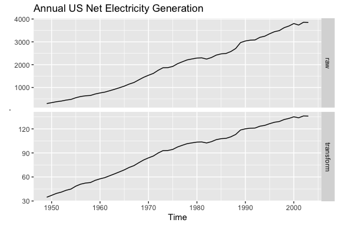

``` r
lambda <- BoxCox.lambda(usgdp)
cbind(raw = usgdp, transform = BoxCox(usgdp, lambda)) %>% 
   autoplot(facets = TRUE) +
   ggtitle("Quarterly US GDP")
```

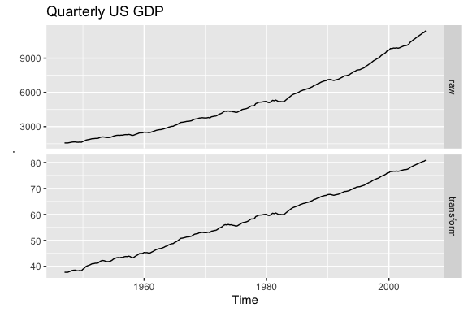

``` r
lambda <- BoxCox.lambda(mcopper)
cbind(raw = mcopper, transform = BoxCox(mcopper, lambda)) %>% 
   autoplot(facets = TRUE) + 
   ggtitle("Monthly Copper Prices")
```

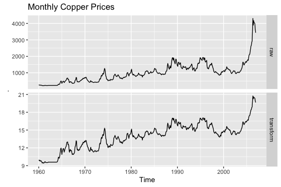

``` r
lambda <- BoxCox.lambda(enplanements)
cbind(raw = enplanements, transform = BoxCox(enplanements, lambda)) %>% 
   autoplot(facets = TRUE) +
   ggtitle("Monthly US domestic enplanements")
```


### Exercise 2

Why is a Box-Cox transformation unhelpful for the cangas data?

-   A Box-Cox transformation is not useful for `cangas` because the variation in the seasonality does not change much in the raw data

``` r
lambda <- BoxCox.lambda(cangas)
cbind(raw = cangas, transform = BoxCox(cangas, lambda)) %>% 
   autoplot(facets = TRUE) +
   ggtitle("Monthly Canadian Gas Production")
```

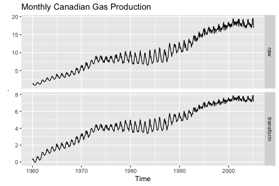

### Exercise 3

What Box-Cox transformation would you select for your retail data (from Exercise 3 in Section 2.10)?

-   A lambda of .1276 transforms the seasonality nicely.

``` r
retaildata <- readxl::read_excel("retail.xlsx", skip = 1)
myts <- ts(retaildata[,"A3349873A"], frequency = 12, start = c(1982, 4))
lambda <- BoxCox.lambda(myts)
cbind(raw = myts, transform = BoxCox(myts, lambda)) %>% 
   autoplot(facets = TRUE)
```


### Exercise 4

For each of the following series, make a graph of the data. If transforming seems appropriate, do so and describe the effect. `dole`, `usdeaths`, `bricksq`.

-   `dole`: Box-Cox transformation with lambda = .33
-   `usdeaths`: no transformation applied (transformation appears meaningless)
-   `bricksq`: no transformation applied (transformation appears meaningless)

``` r
autoplot(dole)
```

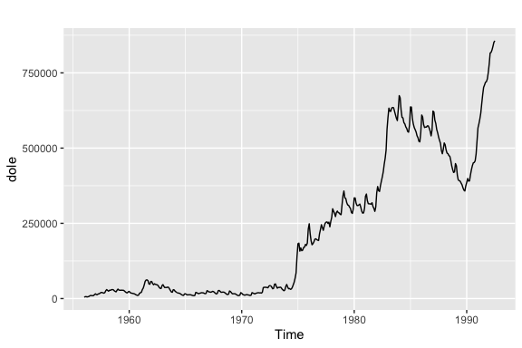

``` r
lambda <- BoxCox.lambda(dole)
cbind(raw = dole, transform = BoxCox(dole, lambda)) %>% 
   autoplot(facets = TRUE)
```

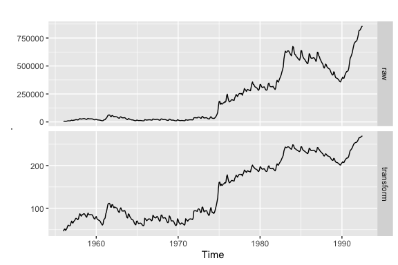

``` r
autoplot(usdeaths)
```

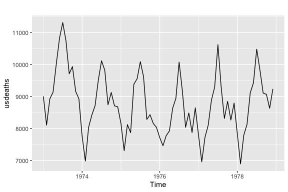

``` r
autoplot(bricksq)
```


### Exercise 5

Calculate the residuals from a seasonal naïve forecast applied to the quarterly Australian beer production data from 1992. The following code will help.

-   The residuals seem to have a right skew. Autocorrelation is also present in the residuals as seen in the ACF and supported by the Ljung-Box Test's p-value of 8.3e-05, which rejects the null hypothesis of no autocorrelation.

``` r
beer <- window(ausbeer, start=1992)
fc <- snaive(beer)
checkresiduals(fc)
```

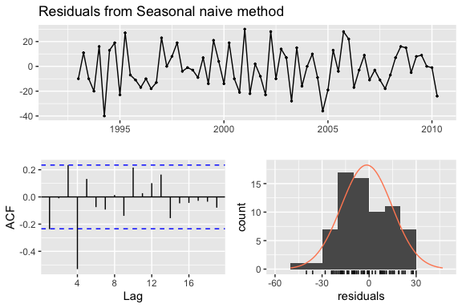

    ## 
    ##  Ljung-Box test
    ## 
    ## data:  Residuals from Seasonal naive method
    ## Q* = 32.269, df = 8, p-value = 8.336e-05
    ## 
    ## Model df: 0.   Total lags used: 8

### Exercise 6

Repeat the exercise for the `WWWusage` and `bricksq` data. Use whichever of naive() or snaive() is more appropriate in each case.

For `WWWusage` both the `naive` and `snaive` methods yield non-normal, autocorrelated errors. Both the ACF and Ljung-Box test reflect autocorrelation in the resiudals of both methods. Given the lack of a seasonal pattern in the series, the `naive` method should be choosen versus the `snaive` method.

``` r
autoplot(naive(WWWusage))
fc <- naive(WWWusage)
checkresiduals(fc)
## 
##  Ljung-Box test
## 
## data:  Residuals from Naive method
## Q* = 145.58, df = 10, p-value < 2.2e-16
## 
## Model df: 0.   Total lags used: 10

autoplot(snaive(WWWusage))
fc2 <- snaive(WWWusage)
checkresiduals(fc2)
## 
##  Ljung-Box test
## 
## data:  Residuals from Seasonal naive method
## Q* = 145.58, df = 10, p-value < 2.2e-16
## 
## Model df: 0.   Total lags used: 10
```


Similarly, for `bricksq` both the `naive` and `snaive` forecast methods result in residuals the are autocorrelated and non-normally distributed. The Ljung-Box test rejects non-autocorrelated residuals for both methods.

``` r
autoplot(naive(bricksq)) + 
   ggtitle("Australian Quarterly Clay Brick Production")
fc <- naive(bricksq)
checkresiduals(fc)
## 
##  Ljung-Box test
## 
## data:  Residuals from Naive method
## Q* = 244.43, df = 8, p-value < 2.2e-16
## 
## Model df: 0.   Total lags used: 8

autoplot(snaive(bricksq)) + 
   ggtitle("Australian Quarterly Clay Brick Production")
fc2 <- snaive(bricksq)
checkresiduals(fc2)
## 
##  Ljung-Box test
## 
## data:  Residuals from Seasonal naive method
## Q* = 233.2, df = 8, p-value < 2.2e-16
## 
## Model df: 0.   Total lags used: 8
```


### Exercise 7

Are the following statements true or false? Explain your answer.

1.  Good forecast methods should have normally distributed residuals.

    -   TRUE: good forecast methods should have normally distributed residuals, but this is not strictly required. Much more importantly, good forecasts should have uncorrelated residuals with mean 0.

2.  A model with small residuals will give good forecasts.

    -   FALSE: Residuals relate to fitted values, not forecast performance, and it may be the case that a particular model fits the insample data too well, resulting in "small" residuals. Nevertheless, out-of-sample performance from over-fit models may be poor. Good forecasts should produce mean-zero and uncorrelated errors.

3.  The best measure of forecast accuracy is MAPE.

    -   FALSE: While the MAPE is a popular measure of forecast error, it has some disadvantages. Mainly, the MAPE struggles with when actuals are very small or even 0.

4.  If your model doesn’t forecast well, you should make it more complicated.

    -   FALSE: more complicated methods do not necessarily improve forecasts. There is also a cost to more complex models: they are hard to interpret. Interpretibility may be an important factor when forming forecasts.

5.  Always choose the model with the best forecast accuracy as measured on the test set.

    -   While out of sample performance is an important factor in choosing a model, it is not the *only* factor. Good models should also produce mean-zero and uncorrelated and homoskedastic errors.

### Exercise 8

For your retail time series (from Exercise 3 in Section 2.10):

-   Split the data into two parts using:

``` r
retaildata <- readxl::read_excel("retail.xlsx", skip = 1)
myts <- ts(retaildata[,"A3349873A"], frequency = 12, start = c(1982, 4))
myts.train <- window(myts, end = c(2010,12))
myts.test <- window(myts, start = 2011)
```

-   Check that your data have been split appropriately by producing the following plot.

``` r
autoplot(myts) +
  autolayer(myts.train, series = "Training") +
  autolayer(myts.test, series = "Test")
```

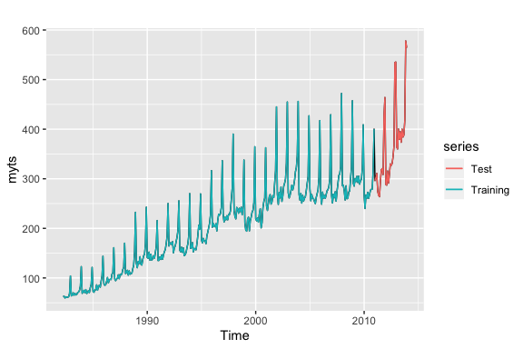

-   Calculate forecasts using snaive applied to myts.train.

``` r
fc <- snaive(myts.train)
```

-   Compare the accuracy of your forecasts against the actual values stored in myts.test.

``` r
accuracy(fc,myts.test)
##                     ME     RMSE      MAE       MPE      MAPE     MASE
## Training set  7.772973 20.24576 15.95676  4.702754  8.109777 1.000000
## Test set     55.300000 71.44309 55.78333 14.900996 15.082019 3.495907
##                   ACF1 Theil's U
## Training set 0.7385090        NA
## Test set     0.5315239  1.297866
```

-   Check the residuals.

``` r
checkresiduals(fc)
```


    ## 
    ##  Ljung-Box test
    ## 
    ## data:  Residuals from Seasonal naive method
    ## Q* = 624.45, df = 24, p-value < 2.2e-16
    ## 
    ## Model df: 0.   Total lags used: 24

Do the residuals appear to be uncorrelated and normally distributed?

-   The residuals are highly autocorelated as seen in the ACF and in the Ljung-Box test. The residuals seem to follow a normal distribution, but also have slightly heavier tails and a higher peak around the mean, suggesting a t-distribution.

How sensitive are the accuracy measures to the training/test split?

-   The accuracy measures are very sensitive to the training/test split. In sample performance is significantly better than out of sample.

### Exercise 9

`visnights` contains quarterly visitor nights (in millions) from 1998 to 2016 for twenty regions of Australia.

-   Use `window()` to create three training sets for `visnights[,"QLDMetro"]`, omitting the last 1, 2 and 3 years; call these train1, train2, and train3, respectively. For example `train1 <- window(visnights[, "QLDMetro"], end = c(2015, 4))`.

``` r
train1 <- window(visnights[, "QLDMetro"], start = 1998, end = c(2015,4))
train2 <- window(visnights[, "QLDMetro"], start = 1998, end = c(2014,4))
train3 <- window(visnights[, "QLDMetro"], start = 1998, end = c(2013,4))
```

-   Compute one year of forecasts for each training set using the `snaive()` method. Call these `fc1`, `fc2` and `fc3`, respectively.

``` r
fc1 <- snaive(train1, h = 4)
fc2 <- snaive(train2, h = 4)
fc3 <- snaive(train3, h = 4)
```

-   Use `accuracy()` to compare the MAPE over the three test sets. Comment on these.

``` r
accuracy(fc1, visnights[, "QLDMetro"] )
##                      ME      RMSE       MAE        MPE     MAPE      MASE
## Training set 0.02006107 1.0462821 0.8475553 -0.2237701 7.976760 1.0000000
## Test set     0.56983879 0.9358727 0.7094002  4.6191866 6.159821 0.8369957
##                    ACF1 Theil's U
## Training set 0.06014484        NA
## Test set     0.09003153 0.4842061
accuracy(fc2, visnights[, "QLDMetro"])
##                      ME      RMSE       MAE        MPE     MAPE      MASE
## Training set 0.01618760 1.0735582 0.8809432 -0.2744747 8.284216 1.0000000
## Test set     0.08203656 0.4117902 0.3133488  0.5875037 3.057463 0.3556969
##                     ACF1 Theil's U
## Training set  0.06610879        NA
## Test set     -0.59903247 0.3336559
accuracy(fc3, visnights[, "QLDMetro"])
##                        ME     RMSE       MAE        MPE     MAPE      MASE
## Training set -0.007455407 1.074544 0.8821694 -0.5625865 8.271365 1.0000000
## Test set      0.370832661 1.058658 0.8625501  4.0472032 8.476977 0.9777602
##                     ACF1 Theil's U
## Training set  0.07317746        NA
## Test set     -0.36890062  1.177346
```

### Exercise 10

Use the Dow Jones index (data set dowjones) to do the following:

-   Produce a time plot of the series.

``` r
autoplot(dowjones)
```

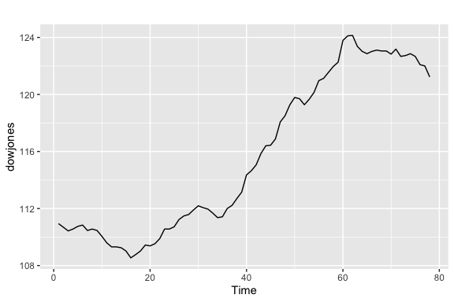

1.  Produce forecasts using the drift method and plot them.

``` r
fc <- rwf(dowjones, drift = TRUE, h = 10)
autoplot(fc)
```

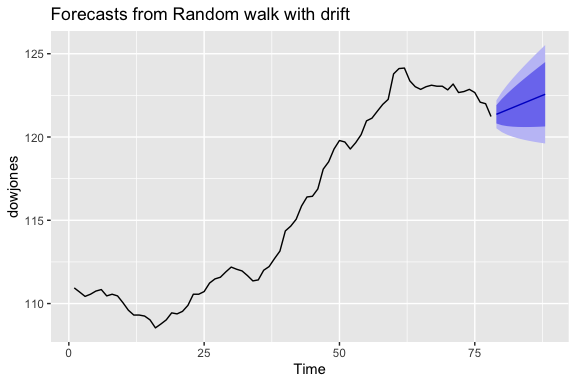

-   Show that the forecasts are identical to extending the line drawn between the first and last observations.

``` r
first <- dowjones[1]
last<- dowjones[length(dowjones)]
slope <- (last - first)/(length(dowjones) - 1)
slope
## [1] 0.1336364
autoplot(dowjones) +
   geom_abline(slope = slope, intercept = first-slope, colour = "red", alpha = 0.8) +
   autolayer(rwf(dowjones, drift = TRUE), PI = FALSE)
```

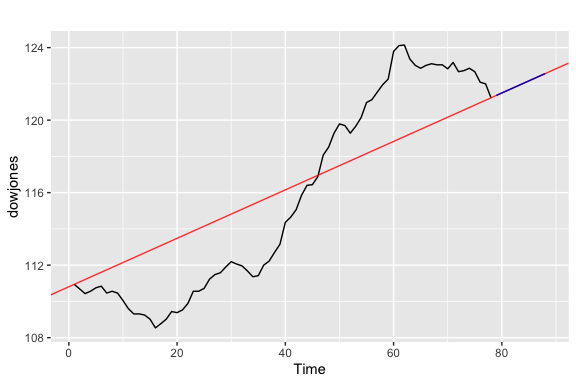

-   Try using some of the other benchmark functions to forecast the same data set. Which do you think is best? Why?

         * The naïve method seems to produce the best forecasts. The mean forecasts is simply too far off from the recent actuals to be reasonable. The drift method seems to aggresive. 

``` r
autoplot(dowjones) +
  autolayer(meanf(dowjones, h = 10),
    series = "Mean", PI = FALSE) +
  autolayer(rwf(dowjones, h = 10),
    series = "Naïve", PI = FALSE) +
  autolayer(rwf(dowjones, drift = TRUE, h = 10),
    series = "Drift", PI = FALSE) +
  ggtitle("Dow-Jones index, 28 Aug - 18 Dec 1972") +
  xlab("Day") + ylab("Closing Price (US$)") +
  guides(colour=guide_legend(title="Forecast"))
```

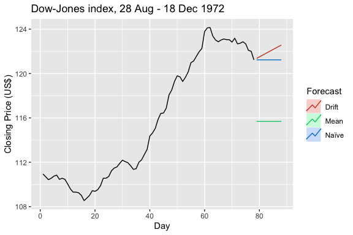

### Exercise 11

Consider the daily closing IBM stock prices (data set `ibmclose`).

-   Produce some plots of the data in order to become familiar with it.

``` r
autoplot(ibmclose)
```

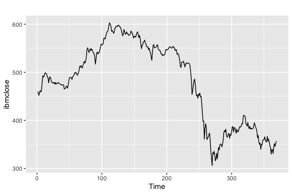

``` r
autoplot(diff(ibmclose))
```


-   Split the data into a training set of 300 observations and a test set of 69 observations.

``` r
train <- window(ibmclose, start = 1, end = 300)
test <- window(ibmclose, start = 301)
```

-   Try using various benchmark methods to forecast the training set and compare the results on the test set. Which method did best?

    -   Both the `naive` and `rwf` methods lend good out of sample forecasts. However, `rwf` yields lower RMSE, MAE, and MAPE statistics, reflecting its superior out of sample performance. A look at the residuals mights also help choose the best model.

``` r
fc_naive <- naive(train, h = 69)
fc_rwf <- rwf(train, drift = TRUE, h = 69)
fc_mean <- meanf(train, h = 69)

autoplot(ibmclose) +
   autolayer(fc_naive, series = "naive", PI = FALSE) +
   autolayer(fc_mean, series = "mean", PI = FALSE) +
   autolayer(fc_rwf, series = "drift", PI = FALSE)
```


``` r
accuracy(fc_naive, test)
##                      ME      RMSE      MAE         MPE     MAPE     MASE
## Training set -0.2809365  7.302815  5.09699 -0.08262872 1.115844 1.000000
## Test set     -3.7246377 20.248099 17.02899 -1.29391743 4.668186 3.340989
##                   ACF1 Theil's U
## Training set 0.1351052        NA
## Test set     0.9314689  2.973486
accuracy(fc_mean, test)
##                         ME      RMSE       MAE        MPE     MAPE
## Training set  1.660438e-14  73.61532  58.72231  -2.642058 13.03019
## Test set     -1.306180e+02 132.12557 130.61797 -35.478819 35.47882
##                  MASE      ACF1 Theil's U
## Training set 11.52098 0.9895779        NA
## Test set     25.62649 0.9314689  19.05515
accuracy(fc_rwf, test)
##                        ME      RMSE       MAE         MPE     MAPE
## Training set 2.870480e-14  7.297409  5.127996 -0.02530123 1.121650
## Test set     6.108138e+00 17.066963 13.974747  1.41920066 3.707888
##                  MASE      ACF1 Theil's U
## Training set 1.006083 0.1351052        NA
## Test set     2.741765 0.9045875  2.361092
```

-   Check the residuals of your preferred method. Do they resemble white noise?

    -   None of the methods yield residuals resembiling white noise. For each mehtod, there is statistically significant autocorrelation in the resiudals. Furthermore, none of the residual distributins seem to fulfill normality (which is not required for good forecasts). However, the `naive` method's residuals come closest to the normal distribution.

``` r
checkresiduals(fc_naive)
## 
##  Ljung-Box test
## 
## data:  Residuals from Naive method
## Q* = 22.555, df = 10, p-value = 0.01251
## 
## Model df: 0.   Total lags used: 10
checkresiduals(fc_mean)
## 
##  Ljung-Box test
## 
## data:  Residuals from Mean
## Q* = 2697.2, df = 9, p-value < 2.2e-16
## 
## Model df: 1.   Total lags used: 10
checkresiduals(fc_rwf)
## 
##  Ljung-Box test
## 
## data:  Residuals from Random walk with drift
## Q* = 22.555, df = 9, p-value = 0.007278
## 
## Model df: 1.   Total lags used: 10
```


### Exercise 12

Consider the sales of new one-family houses in the USA, Jan 1973 – Nov 1995 (data set hsales).

-   Produce some plots of the data in order to become familiar with it.

``` r
autoplot(hsales) + 
   ggtitle("Monthly sales of new one-family\nhouses sold in the USA since 1973")
ggseasonplot(hsales)
ggsubseriesplot(hsales)
```


-   Split the hsales data set into a training set and a test set, where the test set is the last two years of data.

``` r
train <- window(hsales, start = 1973, end = c(1993, 11)) 
test <-  window(hsales, start = c(1993, 12)) 
```

-   Try using various benchmark methods to forecast the training set and compare the results on the test set. Which method did best?

    -   the `snaive` methods produces the best out-of-sample forecasts according to the RMSE, MAE and MAPE.

``` r
fc_mean <- meanf(train, h = 24)
fc_naive <- naive(train, h = 24)
fc_snaive <- snaive(train, h = 24)
fc_rwf <- rwf(train, drift = TRUE, h = 24)
autoplot(hsales) +
   autolayer(fc_mean, series = "mean", PI = FALSE) +
   autolayer(fc_naive, series = "naive", PI = FALSE) +
   autolayer(fc_snaive, series = "snaive", PI = FALSE) +
   autolayer(fc_rwf, series = "drift", PI = FALSE)
```

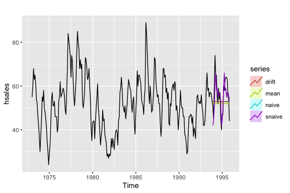

``` r
accuracy(fc_mean, test)
##                        ME      RMSE      MAE       MPE     MAPE      MASE
## Training set 3.510503e-15 12.162811 9.532738 -6.144876 20.38306 1.1234341
## Test set     3.839475e+00  9.022555 7.561587  4.779122 13.26183 0.8911338
##                   ACF1 Theil's U
## Training set 0.8661998        NA
## Test set     0.5377994  1.131713
accuracy(fc_naive, test)
##                     ME     RMSE      MAE       MPE      MAPE      MASE
## Training set -0.008000 6.301111 5.000000 -0.767457  9.903991 0.5892505
## Test set      2.791667 8.628924 7.208333  2.858639 12.849194 0.8495028
##                   ACF1 Theil's U
## Training set 0.1824472        NA
## Test set     0.5377994  1.098358
accuracy(fc_snaive, test)
##                     ME      RMSE      MAE       MPE      MAPE      MASE
## Training set 0.1004184 10.582214 8.485356 -2.184269 17.633696 1.0000000
## Test set     1.0416667  5.905506 4.791667  0.972025  8.545729 0.5646984
##                   ACF1 Theil's U
## Training set 0.8369786        NA
## Test set     0.1687797 0.7091534
accuracy(fc_rwf, test)
##                        ME     RMSE      MAE        MPE      MAPE      MASE
## Training set 1.506410e-15 6.301106 4.999872 -0.7511048  9.903063 0.5892354
## Test set     2.891667e+00 8.658795 7.249000  3.0426108 12.901697 0.8542954
##                   ACF1 Theil's U
## Training set 0.1824472        NA
## Test set     0.5378711  1.100276
```

-   Check the residuals of your preferred method. Do they resemble white noise?

    -   None of the methods provide white noise residuals. Each method's residuals have some degree of statistically significant autocorrelation, suggesting that additional predictors can capture this information to provide better forcasts. Only the residuals of the Seasonal naive method seem to follow a normal distribution.

``` r
checkresiduals(fc_mean)
## 
##  Ljung-Box test
## 
## data:  Residuals from Mean
## Q* = 887.75, df = 23, p-value < 2.2e-16
## 
## Model df: 1.   Total lags used: 24
checkresiduals(fc_naive)
## 
##  Ljung-Box test
## 
## data:  Residuals from Naive method
## Q* = 322.61, df = 24, p-value < 2.2e-16
## 
## Model df: 0.   Total lags used: 24
checkresiduals(fc_snaive)
## 
##  Ljung-Box test
## 
## data:  Residuals from Seasonal naive method
## Q* = 682.2, df = 24, p-value < 2.2e-16
## 
## Model df: 0.   Total lags used: 24
checkresiduals(fc_rwf)
## 
##  Ljung-Box test
## 
## data:  Residuals from Random walk with drift
## Q* = 322.61, df = 23, p-value < 2.2e-16
## 
## Model df: 1.   Total lags used: 24
```


